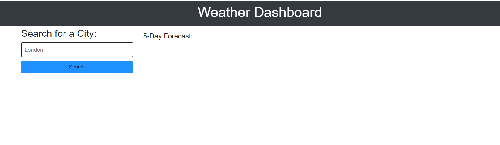
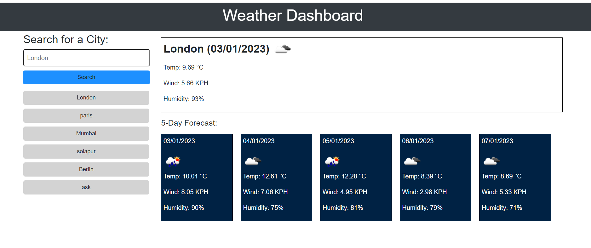
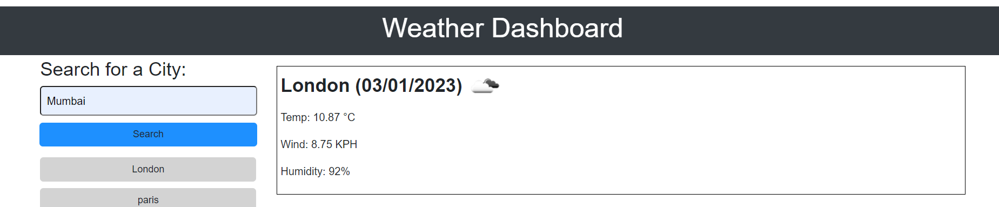
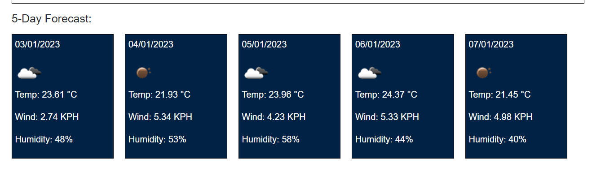

# Weather-Dashboard
## Description
This is a weather application which shows user current and 5 day forecast weather of inputted city.
This app gives information such as temperature, wind, humidity.

## Main Page
Main page looks like this.

Main page after inputting city name and clicking search button

Curent weather is shown like this

5 day forecast weather is shown like this

### The URL of the deployed application

https://nandanippani.github.io/Weather-Dashboard/

### The URL of the GitHub repository that contains my code

https://github.com/Nandanippani/Weather-Dashboard

## Installation

N/A

## Usage

This project is used to demonstrate ability to use functions, return variables, while loop and global variables using Jquery and fetching data from server api.

## Credits

N/A

## License

Please refer to the LICENSE in the repo.
